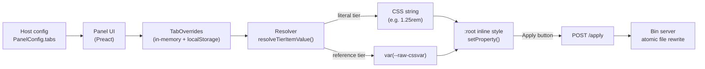

design-token panel は、狭く JSON シリアライズ可能なコントラクトでつながれた 3 つの層に分かれています。スペーシング・タイポグラフィ・サイズ・カラー・アニメーションイージングなど、ホストが独自に定義するすべてのデザイントークンファミリーは、同じ抽象ティアモデルを通じて処理されます。新しいファミリーをプロジェクトに追加するにはホスト設定の変更のみで済み、パッケージ本体の変更は不要です。

## 3 層の概要

パッケージが 3 つの層に分けて管理する関心事は次のとおりです。

1. **Panel UI** — サイドパネルをレンダリングし、タブとコントロールの状態を管理し、`setProperty` で `:root` へオーバーライドを書き込む Preact アイランド。ブラウザ内でのみ動作します。
2. **Host-adapter** — ホストがサイドエフェクトとしてインポートする薄いシム。インライン JSON 設定を読み取り、`configurePanel(...)` を呼び出し、`window.<consoleNamespace>.*` をインストールし、パネルモジュールの遅延ロードをゲートします。
3. **Apply-pipeline** — パネルの Apply ボタンからディスクへの任意パス。パッケージ内のペイロードビルダーと、ファイル書き換えを担うスタンドアロン Node バイナリサーバー (`design-token-panel-server`) の 2 つで構成されます。

```
┌─ Your dev server (Astro / Vite / any host) ──────────────┐
│                                                          │
│  ┌─────────────┐    reads     ┌────────────────┐         │
│  │  Layout     │ ──JSON────▶  │  Host adapter  │         │
│  │  (config)   │              │  (lazy-gate)   │         │
│  └─────────────┘              └────────┬───────┘         │
│                                        │ dynamic import   │
│                                        ▼                  │
│                               ┌────────────────┐         │
│                               │   Panel UI     │ writes  │
│                               │   (Preact)     │ ──────▶ :root
│                               └────────┬───────┘         │
│                                        │ POST /apply     │
└────────────────────────────────────────┼─────────────────┘
                                         │ (HTTP, loopback)
                                         ▼
                            ┌──────────────────────────┐
                            │  Bin server              │
                            │  design-token-panel-     │
                            │  server                  │
                            │  • CORS allow-list       │
                            │  • write-root sandbox    │
                            │  • atomic file rewrites  │
                            └──────────────────────────┘
```

これら 3 層間の境界は安定しています。プロジェクト固有のすべての識別子（ストレージプレフィックス、コンソール名前空間、CSS 変数名、タブレイアウト、ルーティング）は、プレーン JSON としてレイヤー境界を越えます。

## 抽象トークンティアモデル

パネルの各タブ（スペーシング・タイポグラフィ・サイズ・カラー・イージング、またはホストが独自に定義するドメイン）は、すべて同じデータ形状で記述されます。ホストは `PanelConfig` に `tabs: readonly TabConfig[]` を渡し、パネルはそれを基に UI を構築し、リゾルバーが CSS カスタムプロパティの書き込みに変換します。

### なぜティアが必要か

1 ティアのタブは、編集可能な CSS トークンのフラットなリストです。シンプルなケースではこれで十分ですが、デザインシステムでは 2 層構造が必要になることが多くあります。原始的な値のロー層（タイプスケール、カラーパレットなど）と、そのプリミティブにロール名をマッピングするセマンティック層です。

ティアなしでは、ホスト側で 2 つの並列トークン配列を管理し、相互参照を一致させ続け、新しいドメインが追加されるたびにパッケージにパッチを当てる必要があります。

ティアがあれば、ホストは設定で一度関係を宣言するだけで、リゾルバーが `var(--tier1-cssvar)` の出力を処理します。ロープリミティブへの変更は、それを参照するすべてのセマンティックロールに CSS カスケードを通じて自動的に伝播します。

### 設定の形状

```ts
interface PanelConfig {
  // ...識別子とルーティングフィールド...
  tabs: readonly TabConfig[];
  colorPresets?: readonly ColorPreset[];
}

interface TabConfig {
  id: string;
  label: string;
  tiers: readonly TierConfig[];
  advancedTiers?: readonly string[];   // Advanced 開閉に隠すティア id
  colorExtras?: ColorClusterExtras;    // カラータブ専用の非アイテムメタデータ
}

interface TierConfig {
  id: string;
  label: string;
  items: readonly TierItem[];
  referencesTier?: string;             // 設定時、アイテムは別ティアへの参照を保持する
}

interface TierItem {
  id: string;
  cssVar: string;
  label: string;
  group?: string;
  default: string;
  type: TierValueKind;
  pill?: PillSpec;
  readonly?: true;
}
```

### バリュー種別

各 `TierItem` は、レンダリングされる編集コントロールを決定する `type` 判別ユニオンを持ちます。

| `type.kind` | 編集コントロール | ユースケース |
| --- | --- | --- |
| `'length'` | `min`・`max`・`step`・`unit` 付きスライダー | スペーシング、フォントサイズ、ボーダー半径 |
| `'number'` | 単位なしスライダー | 不透明度、行の高さ、z-index スケール |
| `'select'` | ドロップダウン | 定義済みオプションセット |
| `'text'` | フリーテキスト入力 | イージングカーブ、フォントファミリー名、生 CSS 式 |
| `'color'` | カラースウォッチピッカー | パレットエントリ、セマンティックカラーロール |

```ts
type TierValueKind =
  | { kind: 'length'; min: number; max: number; step: number; unit: string }
  | { kind: 'number'; min: number; max: number; step: number }
  | { kind: 'select'; options: readonly string[] }
  | { kind: 'text' }
  | { kind: 'color' };
```

### フラット（1 ティア）タブ

`tiers` に単一ティアを持つタブは、シンプルな編集可能トークンリストとして動作します。各アイテムの値はリテラル CSS 文字列です。

```ts
const spacingTab: TabConfig = {
  id: 'spacing',
  label: 'Spacing',
  tiers: [
    {
      id: 'raw',
      label: 'Spacing',
      items: [
        {
          id: 'myapp-spacing-md',
          cssVar: '--myapp-spacing-md',
          label: 'Spacing M',
          group: 'hsp',
          default: '1rem',
          type: { kind: 'length', min: 0, max: 4, step: 0.0625, unit: 'rem' },
        },
      ],
    },
  ],
};
```

適用時、リゾルバーは `--myapp-spacing-md: 1.25rem`（または現在のオーバーライド値）を直接 `:root` に出力します。

### クロスティア参照

`TierConfig` が `referencesTier` を宣言すると、そのアイテムは CSS 文字列ではなく、名前付きティア内のアイテムの `id` を保持します。適用時にリゾルバーは参照アイテムを検索し、リテラル値の代わりに `var(--target-cssvar)` を出力します。

```ts
const fontTab: TabConfig = {
  id: 'font',
  label: 'Font',
  advancedTiers: ['raw'],          // raw スケールを Advanced 開閉に隠す
  tiers: [
    {
      id: 'raw',
      label: 'Type Scale',
      items: [
        { id: 'myapp-scale-sm',   cssVar: '--myapp-scale-sm',   label: 'Scale SM',   default: '0.875rem', type: { kind: 'length', min: 0.5, max: 2, step: 0.0625, unit: 'rem' } },
        { id: 'myapp-scale-base', cssVar: '--myapp-scale-base', label: 'Scale Base', default: '1rem',     type: { kind: 'length', min: 0.5, max: 2, step: 0.0625, unit: 'rem' } },
        { id: 'myapp-scale-xl',   cssVar: '--myapp-scale-xl',   label: 'Scale XL',   default: '1.75rem',  type: { kind: 'length', min: 1, max: 4, step: 0.0625, unit: 'rem' } },
      ],
    },
    {
      id: 'semantic',
      label: 'Semantic Roles',
      referencesTier: 'raw',      // アイテムは raw ティアのアイテム id を指す
      items: [
        { id: 'myapp-text-body',    cssVar: '--myapp-text-body',    label: 'Body',    default: 'myapp-scale-base', type: { kind: 'text' } },
        { id: 'myapp-text-heading', cssVar: '--myapp-text-heading', label: 'Heading', default: 'myapp-scale-xl',   type: { kind: 'text' } },
      ],
    },
  ],
};
```

`referencesTier: 'raw'` を指定すると、各セマンティックアイテムの `default` は raw アイテムの `id` になります。リゾルバーは次を出力します。

```css
--myapp-text-body:    var(--myapp-scale-base);
--myapp-text-heading: var(--myapp-scale-xl);
```

`--myapp-scale-base` を変更すると、CSS カスケードを通じて `--myapp-text-body` が自動的に更新されます。追加の適用ステップは不要です。

### カラーエクストラ

カラータブは、HSL ピッカーの状態・カラースキーム・ベースロール・セカンダリクラスターなど、アイテム以外のメタデータを `TabConfig` の `colorExtras` に保持します。このメタデータは個々の `TierItem` にはマッピングされず、カラータブの UI クロムとスキーム切り替えを駆動します。

```ts
const colorTab: TabConfig = {
  id: 'color',
  label: 'Color',
  colorExtras: {
    id: 'myapp-colors',
    baseRoles: { bg: '--myapp-palette-0', text: '--myapp-palette-15' },
    baseDefaults: { bg: 0, text: 15 },
    defaultShikiTheme: 'github-dark',
    colorSchemes: { /* スキームレジストリ */ },
    panelSettings: { /* クラスター UI 設定 */ },
  },
  tiers: [
    {
      id: 'palette',
      label: 'Palette',
      items: [
        { id: 'myapp-palette-0', cssVar: '--myapp-palette-0', label: 'Palette 0', default: '#1e1e1e', type: { kind: 'color' } },
        // ...パレットスウォッチ
      ],
    },
    {
      id: 'semantic',
      label: 'Semantic',
      referencesTier: 'palette',
      items: [
        { id: 'primary', cssVar: '--myapp-color-primary', label: 'Primary', default: 'myapp-palette-1', type: { kind: 'color' } },
        // ...セマンティックロール
      ],
    },
  ],
};
```

`tiers` 配列は他のタブと同じ raw/semantic パターンに従います。`colorExtras` は `tiers` の隣に置かれ、カラータブの特化 UI のみが使用します。

## 適用パイプライン



### 状態から CSS へ

パネルはインメモリの `TabOverrides` マップを保持します。これは 2 段階のネストされたレコードです。

```
tierId → itemId → overrideValue (CSS 文字列、または参照アイテム id)
```

スライダーをドラッグしたりカラーを選択するたびに、リゾルバーは `resolveTierItemValue(tab, tierId, itemId, overrides)` を呼び出し、次に `emitTierItemCssValue(resolved)` で最終 CSS 文字列を取得します。結果は即座に `document.documentElement.style.setProperty(cssVar, value)` で `:root` に書き込まれます。

### リゾルバーのセマンティクス

| ティア種別 | オーバーライド値 | リゾルバーの出力 |
| --- | --- | --- |
| リテラル（`referencesTier` なし） | オーバーライド文字列 | そのままの文字列 |
| リテラル、オーバーライドなし | — | pill が設定されていれば `item.pill.customDefault`、なければ `item.default` |
| 参照（`referencesTier` あり） | 参照アイテム id | 名前付きティアから検索した `var(--target-cssvar)` |
| 参照、オーバーライドなし | — | 参照ティアの同 id アイテムの `var(--cssVar)` |

### 任意のディスク書き換え

調整はブラウザ外に出ません。`:root` はすべての変更で同期的に更新され、状態は `${storagePrefix}-state-v2` のキーで `localStorage` に永続化されます。バイナリサーバーはホストが `PanelConfig` に `applyEndpoint` と `applyRouting` を渡した場合にのみ動作し、さらにユーザーが Apply ボタンをクリックしたときのみ起動します。

バイナリサーバーは現在のオーバーライド差分を含む POST を受け取り、CORS 許可リストに対してリクエスト元を検証し、write-root サンドボックスに対して各ルーティングエントリを検証し、ターゲット CSS ファイルをアトミックに書き換えます（テンポラリファイル + リネーム、ファイルごとのミューテックス）。書き込みが失敗した場合はインメモリスナップショットがすべてのファイルをロールバックします。

## 実例 — イージングタブ（zfb デモ）

zfb サンプルアプリは、4 つの生のキュービックベジェプリミティブと 3 つのセマンティックロールを持つイージングタブを提供しています。これはホスト設定のみの追加であり、パッケージの変更はゼロです。

```ts
const easingTab: TabConfig = {
  id: 'easing',
  label: 'Easing',
  tiers: [
    {
      id: 'raw',
      label: 'Raw Easings',
      items: [
        { id: 'ease-in',    cssVar: '--zfbexample-easing-ease-in',    label: 'Ease In',    default: 'cubic-bezier(0.42, 0, 1, 1)',    type: { kind: 'text' } },
        { id: 'ease-out',   cssVar: '--zfbexample-easing-ease-out',   label: 'Ease Out',   default: 'cubic-bezier(0, 0, 0.58, 1)',    type: { kind: 'text' } },
        { id: 'ease-inout', cssVar: '--zfbexample-easing-ease-inout', label: 'Ease InOut', default: 'cubic-bezier(0.42, 0, 0.58, 1)', type: { kind: 'text' } },
        { id: 'linear',     cssVar: '--zfbexample-easing-linear',     label: 'Linear',     default: 'linear',                         type: { kind: 'text' } },
      ],
    },
    {
      id: 'semantic',
      label: 'Semantic',
      referencesTier: 'raw',
      items: [
        { id: 'tab-open',    cssVar: '--zfbexample-easing-tab-open',  label: 'Tab Open',  default: 'ease-in',    type: { kind: 'text' } },
        { id: 'tab-close',   cssVar: '--zfbexample-easing-tab-close', label: 'Tab Close', default: 'ease-out',   type: { kind: 'text' } },
        { id: 'modal-enter', cssVar: '--zfbexample-easing-modal',     label: 'Modal',     default: 'ease-inout', type: { kind: 'text' } },
      ],
    },
  ],
};
```

適用時、リゾルバーは次を出力します。

```css
/* raw ティア — パネルで編集可能なリテラル値 */
--zfbexample-easing-ease-in:    cubic-bezier(0.42, 0, 1, 1);
--zfbexample-easing-ease-out:   cubic-bezier(0, 0, 0.58, 1);
--zfbexample-easing-ease-inout: cubic-bezier(0.42, 0, 0.58, 1);
--zfbexample-easing-linear:     linear;

/* semantic ティア — raw 変数を通してカスケード */
--zfbexample-easing-tab-open:  var(--zfbexample-easing-ease-in);
--zfbexample-easing-tab-close: var(--zfbexample-easing-ease-out);
--zfbexample-easing-modal:     var(--zfbexample-easing-ease-inout);
```

ユーザーが `tab-open` を `ease-in` ではなく `ease-inout` に再マッピングすると、リゾルバーはそのエントリに `var(--zfbexample-easing-ease-inout)` を出力します。コード変更は不要で、`TabOverrides` マップに保存されたオーバーライドが変わるだけです。

## なぜこの分離か

3 層分割がパッケージをポータブルに保っている理由です。各層は特定のコントラクトを通じて境界を越え、すべてのコントラクトは意図的に JSON シリアライズ可能です。

- **Panel UI ↔ ホスト**: 単一の `PanelConfig` オブジェクト。ストレージプレフィックス、コンソール名前空間、モーダルクラスプレフィックス、スキーマ id、すべてのタブ定義、オプションのプリセットライブラリ — すべてホスト提供、すべてプレーン JSON。パネル UI はそれらのコンパイル時の知識を持ちません。
- **Host-adapter ↔ Panel UI**: インライン `<script type="application/json" id="tokenpanel-config">` ペイロードと `configurePanel(...)` 呼び出し。
- **Panel UI ↔ バイナリ**: `application/json` の単一 POST。バイナリは毎回オリジンとルーティングを再検証します。ブラウザはサンドボックスを通じてのみディスクに到達できます。

<Warning>
ホストアダプターコントラクトは**ペアユニットコントラクト**です — `<DesignTokenPanelHost>` と兄弟の `<script>void import('...host-adapter')</script>` ブロックはレイアウト内で常にセットで使用してください。スクリプトタグを省略すると JSON 設定ペイロードはページに出力されますが、それを読み取るアダプターが実行されず、コンソール API が `ReferenceError` をスローします。
</Warning>

## クロスリファレンス

- [Configure Panel リファレンス](/docs/reference/configure-panel) — `PanelConfig` の全フィールドリファレンス。
- [Apply pipeline リファレンス](/docs/reference/apply-pipeline) — CLI フラグ、セキュリティモデル、ルーティング JSON 形状。
- [Color cluster リファレンス](/docs/reference/color-cluster) — `colorExtras` と `ColorClusterExtras` の詳細。
