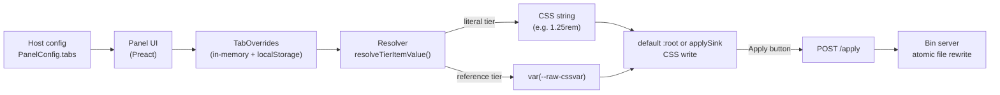

デザイントークンパネルは、限定的で JSON シリアライズ可能な契約によって接続された 3 つの層に分かれています。スペーシング、タイポグラフィ、サイズ、カラー、アニメーションイージングなど、ホストが定義するデザイントークンファミリーや独自ドメインは、すべて同じ抽象ティアモデルを通ります。そのため、プロジェクトに新しいファミリーを追加するときはホスト設定を変更するだけでよく、パッケージを変更する必要はありません。

## 3 層の概要

パッケージは 3 つの責務を、それぞれ独立した層に分けています。

1. **パネル UI** — サイドパネルをレンダリングし、タブとコントロールの状態を管理して、設定済みの `applySink`（またはデフォルトの `:root` シンク）を通じてオーバーライドを書き込む Preact アイランドです。完全にブラウザー内で動作します。
2. **ホストアダプター** — ホストが副作用としてインポートする薄いシムです。インライン JSON 設定を読み、`configurePanel(...)` を呼び出し、`window.<consoleNamespace>.*` と固定名の `window.zdtp.{show,hide,toggle}()` エイリアスをインストールして、パネルモジュールの遅延読み込みをゲートします。
3. **アプライパイプライン** — パネルの Apply ボタンからディスクへ至るオプションの経路です。パッケージ内のペイロードビルダーと、ファイルの書き換えを担うスタンドアロン Node bin サーバー（`zdtp-server`）で構成されます。

```
┌─ Your dev server (Astro / Vite / any host) ──────────────┐
│                                                          │
│  ┌─────────────┐    reads     ┌────────────────┐         │
│  │  Layout     │ ──JSON────▶  │  Host adapter  │         │
│  │  (config)   │              │  (lazy-gate)   │         │
│  └─────────────┘              └────────┬───────┘         │
│                                        │ dynamic import   │
│                                        ▼                  │
│                               ┌────────────────┐         │
│                               │   Panel UI     │ writes  │
│                               │   (Preact)     │ ──────▶ CSS target
│                               └────────┬───────┘         │
│                                        │ POST /apply     │
└────────────────────────────────────────┼─────────────────┘
                                         │ (HTTP, loopback)
                                         ▼
                            ┌──────────────────────────┐
                            │  Bin server              │
                            │  design-token-panel-     │
                            │  server                  │
                            │  • CORS allow-list       │
                            │  • write-root sandbox    │
                            │  • atomic file rewrites  │
                            └──────────────────────────┘
```

この 3 層の境界は安定しています。ストレージプレフィックス、コンソール名前空間、CSS 変数名、タブレイアウト、ルーティングなど、プロジェクト固有の識別子はすべてプレーンな JSON として層の境界を越えます。

## 抽象トークンティアモデル

スペーシング、タイポグラフィ、サイズ、カラー、イージングなど、パネル内のあらゆるタブやホストが定義する任意のドメインは、同じデータ形状で記述されます。ホストは `PanelConfig` の `tabs: readonly TabConfig[]` に設定を渡し、パネルはそれを反復して UI を構築し、リゾルバーが CSS カスタムプロパティへの書き込みに変換します。

### ティアを使う理由

単一ティアのタブは、編集可能な CSS トークンのフラットなリストです。単純なケースには適していますが、デザインシステムでは、タイプスケールやカラーパレットなどのプリミティブ値からなる raw 層と、そのプリミティブにロール名を対応付けるセマンティック層という 2 層構造が必要になることがあります。

ティアがなければ、ホスト側で 2 つのトークン配列を並行して管理し、相互参照の整合性を維持し、新しいドメインを追加するたびにパッケージへパッチを当てる必要があります。

ティアを使うと、ホストは設定で関係を一度宣言するだけで済みます。リゾルバーが `var(--tier1-cssvar)` の出力を担うため、raw プリミティブの編集は、それを参照するすべてのセマンティックロールへ連鎖します。

### 設定の形状

```ts
interface PanelConfig {
  // ...identity and routing fields...
  tabs: readonly TabConfig[];
  dock?: { reflow?: 'body-margin' | 'none' };
  colorPresets?: Record<string, ColorScheme>;
}

interface TabConfig {
  id: string;
  label: string;
  tiers: readonly TierConfig[];
  colorExtras?: ColorClusterExtras;    // color-tab-only non-item metadata
}

interface TierConfig {
  id: string;
  label: string;
  items: readonly TierItem[];
  referencesTier?: string;             // when set, items hold refs to another tier
  semantic?: true;                     // Color-tab semantic tier marker
  referencesRamps?: readonly { tab?: string; tier: string }[];
  preview?: 'size' | 'line-height' | 'family' | 'weight' | 'bar' | 'radius' | 'duration';
  previewBase?: string;
}

interface TierItem {
  id: string;
  cssVar: string;
  label: string;
  default: string;
  type: TierValueKind;
  pill?: PillSpec;
  readonly?: true;
}
```

### 値の種類

各 `TierItem` は、行に表示する編集コントロールを決める判別可能なユニオン型 `type` を持ちます。

| `type.kind` | 編集コントロール | 用途 |
| --- | --- | --- |
| `'length'` | `step`、`unit` を持つテキスト入力 | スペーシング、フォントサイズ、ボーダー半径 |
| `'number'` | 制約のないテキスト入力（単位なし） | 不透明度、行の高さ、z-index スケール |
| `'select'` | ドロップダウン | 定義済みの選択肢 |
| `'text'` | 自由形式のテキスト入力 | イージングカーブ、フォントファミリー名、生の CSS 式 |
| `'color'` | カラースウォッチピッカー | パレット項目、セマンティックカラーロール |
| `'cursor'` | 自由形式のテキスト入力 | cursor プロパティ値（`pointer`、`crosshair` などのキーワード、または `url(...) <fallback>`） |
| `'content'` | 自由形式のテキスト入力 | 疑似要素の content プロパティ値（引用符付き文字列、`none`、`normal`、`url(...)`、生成コンテンツ関数） |
| `'mask-image'` | 自由形式のテキスト入力 | mask-image プロパティ値（`none`、`url(...)`、グラデーション関数） |

```ts
type TierValueKind =
  | { kind: 'length'; step: number; unit: string; units?: readonly string[] }
  | { kind: 'number'; step: number; unit?: string }
  | { kind: 'select'; options: readonly string[] }
  | { kind: 'text' }
  | { kind: 'color'; format?: 'hex' | 'oklch' }
  | { kind: 'cursor' }
  | { kind: 'content' }
  | { kind: 'mask-image' };
```

### フラットな 1 ティアタブ

`tiers` に 1 つのティアだけを持つタブは、単純な編集可能トークンリストとして動作します。各項目の値はリテラルな CSS 文字列です。

```ts
const spacingTab: TabConfig = {
  id: 'spacing',
  label: 'Spacing',
  tiers: [
    {
      id: 'raw',
      label: 'Spacing',
      items: [
        {
          id: 'myapp-spacing-md',
          cssVar: '--myapp-spacing-md',
          label: 'Spacing M',
          default: '1rem',
          type: { kind: 'length', step: 0.0625, unit: 'rem' },
        },
      ],
    },
  ],
};
```

適用時、リゾルバーは `--myapp-spacing-md: 1.25rem`（または現在のオーバーライド値）を、設定済みの `applySink` へ直接出力します。シンクが設定されていなければ `:root` へ出力します。

### ティア間参照

`TierConfig` が `referencesTier` を宣言している場合、その項目が保持するのは CSS 文字列ではなく、指定されたティア内の項目の `id` です。適用時、リゾルバーは参照先の項目を検索し、リテラル値ではなく `var(--target-cssvar)` を出力します。

```ts
const fontTab: TabConfig = {
  id: 'font',
  label: 'Font',
  tiers: [
    {
      id: 'raw',
      label: 'Type Scale',
      items: [
        { id: 'myapp-scale-sm',   cssVar: '--myapp-scale-sm',   label: 'Scale SM',   default: '0.875rem', type: { kind: 'length', step: 0.0625, unit: 'rem' } },
        { id: 'myapp-scale-base', cssVar: '--myapp-scale-base', label: 'Scale Base', default: '1rem',     type: { kind: 'length', step: 0.0625, unit: 'rem' } },
        { id: 'myapp-scale-xl',   cssVar: '--myapp-scale-xl',   label: 'Scale XL',   default: '1.75rem',  type: { kind: 'length', step: 0.0625, unit: 'rem' } },
      ],
    },
    {
      id: 'semantic',
      label: 'Semantic Roles',
      referencesTier: 'raw',      // items point at raw-tier item ids
      items: [
        { id: 'myapp-text-body',    cssVar: '--myapp-text-body',    label: 'Body',    default: 'myapp-scale-base', type: { kind: 'text' } },
        { id: 'myapp-text-heading', cssVar: '--myapp-text-heading', label: 'Heading', default: 'myapp-scale-xl',   type: { kind: 'text' } },
      ],
    },
  ],
};
```

`referencesTier: 'raw'` があるため、各セマンティック項目の `default` は raw 項目の `id` です。リゾルバーは次を出力します。

```css
--myapp-text-body:    var(--myapp-scale-base);
--myapp-text-heading: var(--myapp-scale-xl);
```

`--myapp-scale-base` を変更すると、CSS カスケードを通じて `--myapp-text-body` も自動的に更新されます。追加の適用手順は不要です。

### カラー固有の追加設定

カラータブは、カラーピッカー設定、カラースキーム、ベースロール、オプションのセカンダリクラスター情報など、項目以外の追加メタデータを `TabConfig` の `colorExtras` に保持します。このメタデータは個々の `TierItem` には対応せず、カラータブの UI とスキーム切り替えを制御します。

```ts
const colorTab: TabConfig = {
  id: 'color',
  label: 'Color',
  colorExtras: {
    id: 'myapp-colors',
    baseRoles: { background: '--myapp-palette-0', foreground: '--myapp-palette-15' },
    baseDefaults: { background: 0, foreground: 15 },
    defaultShikiTheme: 'github-dark',
    colorSchemes: { /* scheme registry */ },
    panelSettings: { /* cluster UI settings */ },
  },
  tiers: [
    {
      id: 'palette',
      label: 'Palette',
      items: [
        { id: 'myapp-palette-0', cssVar: '--myapp-palette-0', label: 'Palette 0', default: '#1e1e1e', type: { kind: 'color' } },
        // ...more palette swatches
      ],
    },
    {
      id: 'semantic',
      label: 'Semantic',
      referencesTier: 'palette',
      items: [
        { id: 'primary', cssVar: '--myapp-color-primary', label: 'Primary', default: 'myapp-palette-1', type: { kind: 'color' } },
        // ...more semantic roles
      ],
    },
  ],
};
```

`tiers` 配列は、ほかのタブと同じ raw／semantic パターンに従います。`colorExtras` は `tiers` と同じ階層に置かれ、カラータブ専用 UI だけが使用します。

## フォント見本とホストページへのレンダリング

フォントタブでは、`preview` メタデータをティアに指定できます。`size` ティアは解決後のピクセル値で並べ替えられ、設定済みの見本文字列を表示します。`line-height` ティアでは、その文字列を基準サイズで繰り返します。`previewBase` が CSS 変数を指定している場合、レンダラーはまずマニフェスト内で一致する項目を解決し、次にドキュメントルートの算出値を解決します。指定がなければ、16px に最も近い解決済みサイズを使い、サイズを解決できない場合は 16px を使います。`family` または `weight` ティアの最初の項目が、すべてのサンプルに使うフォントスタイルを提供します。`bar`、`radius`、`duration` は通常のトークン行にコンパクトなグリフを表示します。

フォントタブの **Render on page** オプションは、`body` を第一候補として `div.tokenpanel-on-page-specimen[data-zdtp-specimen]` ポータルを作成します。ポータルは意図的にホストページのフォントと前景色を継承します。パネル chrome ではないため、トークン、ハイライト、ピッカーのスキャンから除外されます。レベル 3 の見出しと、`preview: 'size'` の各項目につき 1 行を表示する **Scale** セクション、さらに line-height ティアごとの **Line height** セクションを含みます。各 line-height サンプルは `--tokenpanel-specimen-line` を通じて行送りガイドを公開し、ツールバーの幅（240〜720px、デフォルト 420px）を使用します。

このポータルが有効な間、パネルはページ上の見本用スペースを確保するため、一時的に `right` ドックを取得します。以前のモードは別のストレージキーではなくメモリ内に記憶され、このオプションを無効にしたとき、パネルを閉じたとき、ナビゲーションでシェルがアンマウントされたとき、またはドックの所有権を失ったときに復元されます。

## ドックのリフローとホストへの変更

`dock.reflow` は、`right` または `bottom` ドックによるホストドキュメントへの副作用を制御します。デフォルトの `'body-margin'` は、`body.style.margin-right` または `body.style.margin-bottom` を現在のドック寸法に設定し、同じピクセル値をドキュメントルートの `--zdtp-dock-inset-right` または `--zdtp-dock-inset-bottom` として公開します。`'none'` はルートの inset を公開しますが、body のマージンを取得前の値へ正確に戻します。レジストリが許可する所有者は、バンドルをまたいで各辺につき 1 つです。別の所有者は `float` へフォールバックします。最初の取得時にインライン値と優先度の両方を保存し、解放するたびにそれらを正確に復元します。

`float` はドラッグでき、`right`／`bottom` は内側の辺からサイズを変更できます。`mini` はコンパクトなピルで、展開すると最後のフルモードに戻ります。ドックモード、寸法、ゴーストアイドル設定はトークン状態から独立しており、インスタンスのストレージプレフィックス配下に永続化されます。

## トークン状態を扱う単一のトランザクション経路

マウント済みパネルでのトークン変更は、すべて `commitTweakState(reason, updater, options)` を通ります。トランザクションは、次の状態を適用し、永続化エンベロープを保存し、コンポーネント状態を更新してから履歴を記録する、という固定順序で進みます。単一行の編集、一括編集、要素インスペクトでの調整／復元、インポート、スナップショットの復元、undo／redo で使われます。そのため、一括操作で多数の行を変更しても履歴エントリーは 1 つです。履歴はメモリ内だけに保持されます。v4 エンベロープと A/B スナップショットスロットは別々に永続化され、`last-applied` には変更状態インジケーターが使うフラットな比較ベースラインが保存されます。ディスクへの適用に成功すると `{}` にリセットされ、書き込みが確認された変数だけがライブ状態から整合されます。

## アプライパイプライン



### 状態から CSS へ

パネルは、2 レベルのネストされたレコードである `TabOverrides` マップをメモリ内に保持します。

```
tierId → itemId → overrideValue (CSS string or ref item id)
```

入力の変更やカラー選択があるたびに、リゾルバーは `resolveTierItemValue(tab, tierId, itemId, overrides)` を呼び、続いて `emitTierItemCssValue(resolved)` を呼んで最終的な CSS 文字列を取得します。結果は、`document.documentElement.style.setProperty(cssVar, value)` を通じてデフォルトの `:root` ターゲットへ、またはそのインスタンスに設定された `applySink` へ即座に書き込まれます。

### リゾルバーのセマンティクス

| ティア種別 | オーバーライド値 | リゾルバーの出力 |
| --- | --- | --- |
| リテラル（`referencesTier` なし） | オーバーライド文字列 | オーバーライド文字列をそのまま出力 |
| リテラル、オーバーライドなし | — | ピルが設定されていれば `item.pill.customDefault`、それ以外は `item.default` |
| 参照（`referencesTier` あり） | 参照項目 id | 指定ティアから検索した `var(--target-cssvar)` |
| 参照、オーバーライドなし | — | 参照先ティアで同じ id を持つ項目の `var(--cssVar-of-item-with-same-id)` |
| 参照、オーバーライドが不明な id を指す | 古い id または存在しない id | 参照先ティアで `itemId` と一致する id の項目へフォールバック。それもなければ参照先ティアの最初の項目へフォールバック。エラーはスローされません。 |

### ストレージスキーマとマイグレーション

状態は `localStorage` の `${storagePrefix}-state-v4` に永続化されます。アップグレード後の初回読み込み時に、既存の v3 状態は自動的に v4 エンベロープへ移行されます（従来の v3 キーは削除されず残ります）。v2 と v1 は v3 に正規化されたあと、同じ処理内で v4 へコピーされます。ユーザー操作は不要です。

| ストレージキー | 内容 | ライフサイクル |
| --- | --- | --- |
| `${storagePrefix}-state-v4` | 現在の統合エンベロープ。v3 と同じスライスですが、`color`（およびセカンダリクラスターのスライス）は単一のフラットオブジェクトではなく、アクティブなスキームとモードの identity をキーにした identity ごとのスロットです。 | ライブ。変更のたびに書き込まれます。[スキームごとのカラー永続化](./configure-panel.mdx)を参照してください。 |
| 以前の v3 キー | v3 エンベロープ（単一のフラットな `color` スロット）。初回読み込み時に v4 へ移行されます。ダウングレード後も読み取れるよう、削除せず残します。 | 移行用。[ストレージキーの導出](./configure-panel.mdx)を参照してください。 |
| 以前の v2 キー | v2 エンベロープ。初回読み込み時に v3 へ移行し、そこから v4 へ移行したあと削除されます。 | 移行用。 |
| `${storagePrefix}-state` | v2 より前のフラットな状態（カラーのみ）。初回読み込み時に v3 へ移行し、そこから v4 へ移行したあと削除されます。 | レガシー。 |

### JSON のエクスポートとインポート

**Export** ボタンは、`$schema` フィールドで `SCHEMA_V2` を示す JSON ファイルを出力します。ただし、状態に v2 の数値だけのリーフでは表せないセマンティックマッピング（`{ literal }`、`{ literal: { light, dark } }`、`{ ref }` の値）が含まれる場合は、スーパーセットである `SCHEMA_V3` を使用します。**Import** モーダルは `SCHEMA_V1`、`SCHEMA_V2`、`SCHEMA_V3` のペイロードを受け入れ、適用前に内部で正規化します。`PanelConfig.schemaId` は `getDesignTokenSchema()` が返す表示専用のラベルです。組み込み UI はこの値を読み取らず、シリアライザーやバリデーターから参照されることもありません。[`PanelConfig` インターフェース](./configure-panel.mdx)を参照してください。エクスポートスキーマのバージョンは localStorage スキーマのバージョンとは独立しており、一方の変更がもう一方の変更を意味するわけではありません。

### オプションのディスク書き換え

調整内容が自動的にブラウザー外へ出ることはありません。変更のたびにアクティブな CSS ターゲットが同期的に更新され、状態が `localStorage` の `${storagePrefix}-state-v4` に永続化されます。bin サーバーが動作するのは、ホストが `PanelConfig` に `applyEndpoint` と `applyRouting` を渡した場合だけで、それでもユーザーが Apply をクリックするまで起動しません。

bin サーバーは、現在のオーバーライド diff を POST で受け取り、リクエスト元を CORS 許可リストに照らして検証し、各ルーティングエントリーを write-root サンドボックスに照らして検証して、対象 CSS ファイルをアトミックに書き換えます（ファイルごとのミューテックス、テンポラリファイルと rename）。書き込みが失敗した場合はメモリ内のスナップショットからロールバックし、ファイルが中途半端な状態で残らないようにします。

## 実例 — easing タブ（zfb デモ）

zfb サンプルアプリには、4 つの raw cubic-bezier プリミティブと 3 つのセマンティックロールを持つ easing タブがあります。ホスト設定だけで追加されており、パッケージの変更は不要です。

```ts
const easingTab: TabConfig = {
  id: 'easing',
  label: 'Easing',
  tiers: [
    {
      id: 'raw',
      label: 'Raw Easings',
      items: [
        { id: 'ease-in',    cssVar: '--zfb-easing-ease-in',    label: 'Ease In',    default: 'cubic-bezier(0.42, 0, 1, 1)',    type: { kind: 'text' } },
        { id: 'ease-out',   cssVar: '--zfb-easing-ease-out',   label: 'Ease Out',   default: 'cubic-bezier(0, 0, 0.58, 1)',    type: { kind: 'text' } },
        { id: 'ease-inout', cssVar: '--zfb-easing-ease-inout', label: 'Ease InOut', default: 'cubic-bezier(0.42, 0, 0.58, 1)', type: { kind: 'text' } },
        { id: 'linear',     cssVar: '--zfb-easing-linear',     label: 'Linear',     default: 'linear',                         type: { kind: 'text' } },
      ],
    },
    {
      id: 'semantic',
      label: 'Semantic',
      referencesTier: 'raw',
      items: [
        { id: 'tab-open',    cssVar: '--zfb-easing-tab-open',  label: 'Tab Open',  default: 'ease-in',    type: { kind: 'text' } },
        { id: 'tab-close',   cssVar: '--zfb-easing-tab-close', label: 'Tab Close', default: 'ease-out',   type: { kind: 'text' } },
        { id: 'modal-enter', cssVar: '--zfb-easing-modal',     label: 'Modal',     default: 'ease-inout', type: { kind: 'text' } },
      ],
    },
  ],
};
```

適用時、リゾルバーは次を出力します。

```css
/* raw tier — literal values editable in the panel */
--zfb-easing-ease-in:    cubic-bezier(0.42, 0, 1, 1);
--zfb-easing-ease-out:   cubic-bezier(0, 0, 0.58, 1);
--zfb-easing-ease-inout: cubic-bezier(0.42, 0, 0.58, 1);
--zfb-easing-linear:     linear;

/* semantic tier — cascade through raw vars */
--zfb-easing-tab-open:  var(--zfb-easing-ease-in);
--zfb-easing-tab-close: var(--zfb-easing-ease-out);
--zfb-easing-modal:     var(--zfb-easing-ease-inout);
```

ユーザーが `tab-open` の参照先を `ease-in` から `ease-inout` に変更すると、リゾルバーはそのエントリーに `var(--zfb-easing-ease-inout)` を出力します。コード変更は不要で、`TabOverrides` マップに保存されるオーバーライドだけが変わります。

## この分離が必要な理由

3 層への分割によって、パッケージのポータビリティが保たれます。各層は固有の契約を通じて境界を越え、そのすべてが意図的に JSON シリアライズ可能になっています。

- **パネル UI ↔ ホスト**: 単一の `PanelConfig` オブジェクトです。ストレージプレフィックス、コンソール名前空間、モーダルクラスプレフィックス、スキーマ id、すべてのタブ定義、オプションのプリセットライブラリーは、すべてホストから供給されるプレーンな JSON です。パネル UI はコンパイル時にこれらを一切認識しません。
- **ホストアダプター ↔ パネル UI**: インラインの `<script type="application/json" id="tokenpanel-config">` ペイロードと `configurePanel(...)` 呼び出しです。
- **パネル UI ↔ bin**: `application/json` による単一の POST です。bin は毎回オリジンとルーティングを再検証します。ブラウザーからディスクへ到達するには、必ずサンドボックスを通ります。

<Warning>
ホストアダプターの契約は**対になる単位の契約**です。`<DesignTokenPanelHost>` と、同階層の `<script>void import('...host-adapter')</script>` ブロックを、レイアウト内へ必ず一緒に配置してください。script タグを省略すると JSON 設定は出力されますが、それを読み取るアダプターが実行されないため、コンソール API は `ReferenceError` をスローします。
</Warning>

## 関連リファレンス

- [パネル設定リファレンス](./configure-panel.mdx) — `PanelConfig` の全フィールド。
- [アプライパイプラインのリファレンス](./apply-pipeline.mdx) — CLI フラグ、セキュリティモデル、ルーティング JSON の形状。
- [カラークラスターのリファレンス](./color-cluster.mdx) — `colorExtras` と `ColorClusterExtras` の詳細。
