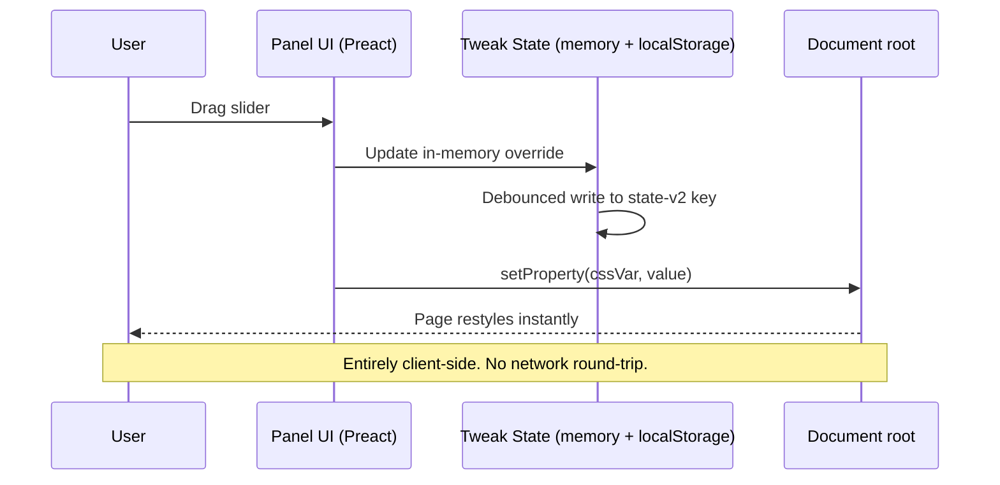
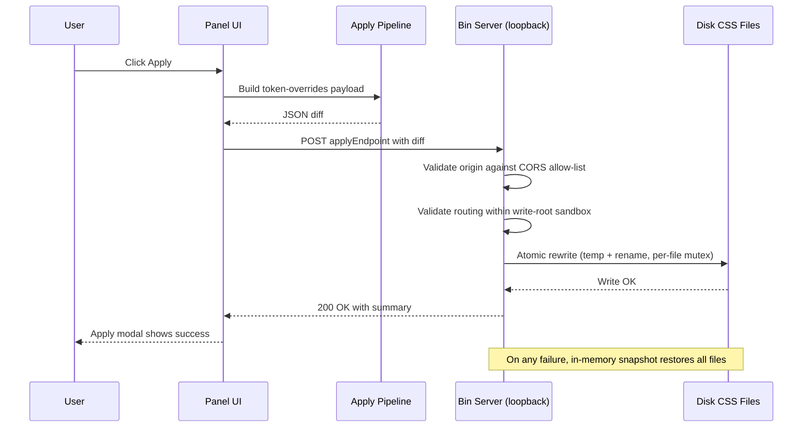
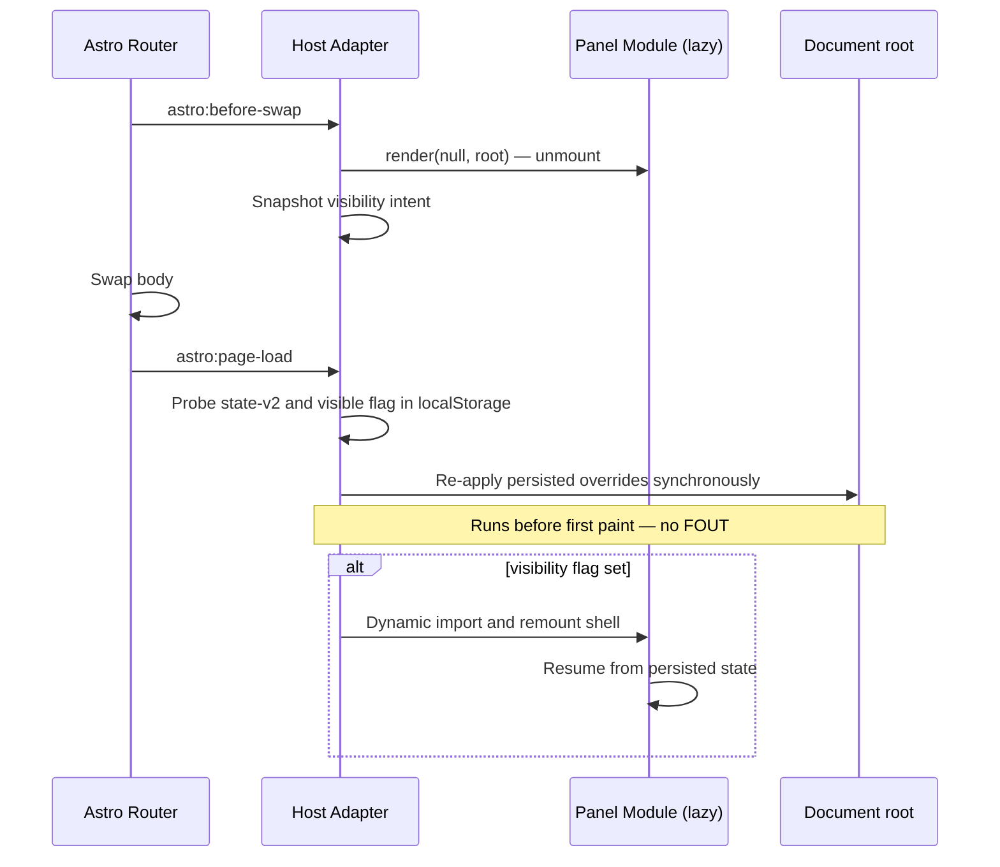

The design-token panel is split into three layers that talk to each other through narrow, JSON-serializable contracts. Most of the package's portability story falls out of that split — the panel UI never knows what host it runs in, the host-adapter never knows what tokens you ship, and the apply-pipeline never runs in the browser.

## Overview

There are three concerns and the package keeps them in three separate layers:

1. **Panel UI** — the Preact island that renders the side panel, owns tab/control state, and writes overrides to `:root` via `setProperty`. Lives entirely in the browser.
2. **Host-adapter** — the thin shim a host imports as a side effect. It reads the inline JSON config, calls `configurePanel(...)`, installs `window.<consoleNamespace>.*`, and gates the lazy-load of the panel module.
3. **Apply-pipeline** — the optional path from the panel's "Apply" button back to disk. It's the in-package payload builder plus the standalone Node bin server (`design-token-panel-server`) that owns the file rewrites.

```
┌─ Your dev server (Astro / Vite / any host) ──────────────┐
│                                                          │
│  ┌─────────────┐    reads     ┌────────────────┐         │
│  │  Layout     │ ──JSON────▶  │  Host adapter  │         │
│  │  (config)   │              │  (lazy-gate)   │         │
│  └─────────────┘              └────────┬───────┘         │
│                                        │ dynamic import   │
│                                        ▼                  │
│                               ┌────────────────┐         │
│                               │   Panel UI     │ writes  │
│                               │   (Preact)     │ ──────▶ :root
│                               └────────┬───────┘         │
│                                        │ POST /apply     │
└────────────────────────────────────────┼─────────────────┘
                                         │ (HTTP, loopback)
                                         ▼
                            ┌──────────────────────────┐
                            │  Bin server              │
                            │  design-token-panel-     │
                            │  server                  │
                            │  • CORS allow-list       │
                            │  • write-root sandbox    │
                            │  • atomic file rewrites  │
                            └──────────────────────────┘
```

The boundaries between these three layers are stable — every project-specific identifier (storage prefix, console namespace, palette CSS-var template, semantic names, routing) crosses a layer boundary as plain JSON. That's the lever that lets the same package ship into Astro, Vite, Next, or a Rust SSG without code changes.

## Layer responsibilities

### Panel UI

The Preact tree under [`src/panel.tsx`](https://github.com/Takazudo/zudo-design-token-panel/blob/main/packages/zudo-design-token-panel/src/panel.tsx) plus the per-tab components under `src/tabs/`. It:

- Renders one row per editable token, driven by the host-supplied `TokenManifest`.
- Renders the color tab (palette + base roles + semantic table) from the host-supplied `ColorClusterConfig`.
- Owns the in-memory `TweakState` and persists it to `localStorage` under keys derived from `storagePrefix`.
- Writes overrides to `document.documentElement.style.setProperty(...)` against the consumer's CSS-var names.

The panel UI never reads consumer CSS variables — it only writes to them. Its own chrome is scoped under the panel-private `--tokentweak-*` namespace.

<Tip>
The full surface for `TokenManifest` and `ColorClusterConfig` lives at [/docs/reference/configure-panel](/docs/reference/configure-panel). The panel-private chrome variables are documented at [/docs/reference/panel-css-tokens](/docs/reference/panel-css-tokens).
</Tip>

### Host-adapter

A small bundle at [`src/astro/host-adapter.ts`](https://github.com/Takazudo/zudo-design-token-panel/blob/main/packages/zudo-design-token-panel/src/astro/host-adapter.ts) that the consumer's layout imports as a side effect:

```ts
void import('@takazudo/zudo-design-token-panel/astro/host-adapter');
```

It owns the boundary between the host page and the panel module:

- **Reads the inline config**: `<DesignTokenPanelHost>` emits a `<script type="application/json" id="tokenpanel-config">` payload; the adapter `JSON.parse`s it and calls `configurePanel(...)` synchronously at module init.
- **Installs the console API** (`showDesignPanel` / `hideDesignPanel` / `toggleDesignPanel`) on `window[consoleNamespace]` eagerly — even before the panel module has loaded.
- **Gates the lazy import**: probes `localStorage` for either the `${storagePrefix}-state-v2` payload or the `${storagePrefix}:visible` flag and dynamically imports the panel module only when one is set.
- **Hooks Astro view-transitions** (`astro:before-swap` / `astro:page-load`) so soft navigation re-applies persisted overrides without a flash and without double-mounting.

The adapter is the only layer that knows about Astro at all. The panel UI itself is framework-agnostic.

### Apply-pipeline

Two pieces stitched through HTTP:

- **In-package payload builder** under [`src/apply/`](https://github.com/Takazudo/zudo-design-token-panel/tree/main/packages/zudo-design-token-panel/src/apply) — turns the current `TweakState` into a routed token-overrides payload using the host-supplied `applyRouting` map.
- **Bin server** under [`src/bin/`](https://github.com/Takazudo/zudo-design-token-panel/tree/main/packages/zudo-design-token-panel/src/bin) and [`src/server/`](https://github.com/Takazudo/zudo-design-token-panel/tree/main/packages/zudo-design-token-panel/src/server) — a standalone Node loopback HTTP server (`design-token-panel-server`) that receives the POST, validates the request against the CORS allow-list, validates each routing entry against the `--write-root` sandbox, and rewrites the target CSS files atomically.

The apply-pipeline is **optional**. Hosts that only need export/import omit `applyEndpoint` and `applyRouting` from `PanelConfig`; the Apply button stays disabled with a tooltip.

<Info>
Full CLI flag surface, security model, and routing JSON shape are documented at [/docs/reference/apply-pipeline](/docs/reference/apply-pipeline).
</Info>

## Data flow

Three flows cover the moments the layers actually interact: a tweak (UI-only), an apply (UI → bin → disk), and a view-transition reapply (host re-render).

### On tweak — user moves a slider



A tweak never leaves the browser. The bin server does not need to be running for the panel to be useful — export/import to JSON works without it, and `:root` is updated synchronously on every change.

### On apply — commit overrides to disk



The browser side ends at the POST. Everything past that — origin checks, sandbox checks, atomic write, mutex serialisation, rollback-on-failure — happens in the bin process and is identical regardless of the host framework that spawned the bin.

### On view-transition reapply — host re-renders



Soft navigation through Astro's `<ClientRouter />` is the only reason the host-adapter has lifecycle hooks. On non-Astro hosts the same module loads, the same console API is installed, and the same lazy-load gate runs — the `astro:*` listeners simply never fire.

## Why this separation?

The three-layer split is what keeps the package portable. Each layer crosses its boundary through a specific contract, and every contract is JSON-serializable on purpose.

- **Panel UI ↔ host**: a single `PanelConfig` object. Storage prefix, console namespace, modal class prefix, schema id, the editable token list, the entire color cluster (palette + semantics + scheme registry), and the optional preset library — all host-supplied, all plain JSON. The panel UI has no compile-time knowledge of any of them.
- **Host-adapter ↔ panel UI**: the inline `<script type="application/json" id="tokenpanel-config">` payload plus the `configurePanel(...)` call. Functions, class instances, and `undefined` would silently disappear across this boundary, so the contract forbids them.
- **Panel UI ↔ bin**: a single POST with `application/json`. The bin doesn't trust the request — it re-validates origin and routing every time. The browser can't reach disk without going through the sandbox.

That last point is worth its own note:

<Warning>
The host-adapter contract is a **paired-unit contract** — `<DesignTokenPanelHost>` AND a sibling `<script>void import('...host-adapter')</script>` block must appear together in your layout. Omitting the script tag emits the JSON config but never executes the adapter that reads it; the console API throws `ReferenceError`. See the [package README §4.1.2](https://github.com/Takazudo/zudo-design-token-panel/blob/main/packages/zudo-design-token-panel/README.md#412-drop-the-host-into-your-layout) and [§12.1](https://github.com/Takazudo/zudo-design-token-panel/blob/main/packages/zudo-design-token-panel/README.md#121-host-adapter-side-effect-import-paired-unit-contract) for the full rationale and bundler detail.
</Warning>

The benefit of this design is portability. The benefit you actually feel is that you can drop the panel into a brand-new host and only think about your `PanelConfig`, not about layer wiring.
