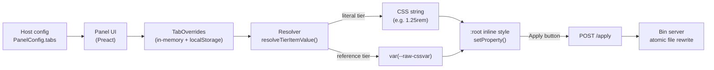

The design-token panel is split into three layers connected through narrow, JSON-serializable contracts. Host-coined design-token families — spacing, typography, size, color, animation easing, or any custom domain — all pass through the same abstract tier model, so adding a new family to your project requires only a host-config change and zero package changes.

## Three-layer overview

There are three concerns the package keeps in three separate layers:

1. **Panel UI** — the Preact island that renders the side panel, owns tab and control state, and writes overrides to `:root` via `setProperty`. Lives entirely in the browser.
2. **Host-adapter** — the thin shim a host imports as a side effect. It reads the inline JSON config, calls `configurePanel(...)`, installs `window.<consoleNamespace>.*`, and gates the lazy-load of the panel module.
3. **Apply-pipeline** — the optional path from the panel's Apply button back to disk. It is the in-package payload builder plus the standalone Node bin server (`zdtp-server`) that owns the file rewrites.

```
┌─ Your dev server (Astro / Vite / any host) ──────────────┐
│                                                          │
│  ┌─────────────┐    reads     ┌────────────────┐         │
│  │  Layout     │ ──JSON────▶  │  Host adapter  │         │
│  │  (config)   │              │  (lazy-gate)   │         │
│  └─────────────┘              └────────┬───────┘         │
│                                        │ dynamic import   │
│                                        ▼                  │
│                               ┌────────────────┐         │
│                               │   Panel UI     │ writes  │
│                               │   (Preact)     │ ──────▶ :root
│                               └────────┬───────┘         │
│                                        │ POST /apply     │
└────────────────────────────────────────┼─────────────────┘
                                         │ (HTTP, loopback)
                                         ▼
                            ┌──────────────────────────┐
                            │  Bin server              │
                            │  design-token-panel-     │
                            │  server                  │
                            │  • CORS allow-list       │
                            │  • write-root sandbox    │
                            │  • atomic file rewrites  │
                            └──────────────────────────┘
```

The boundaries between these three layers are stable — every project-specific identifier (storage prefix, console namespace, CSS-var names, tab layout, routing) crosses a layer boundary as plain JSON.

## The abstract token-tier model

Every tab in the panel — spacing, typography, size, color, easing, or any host-coined domain — is described by the same data shape. The host passes `tabs: readonly TabConfig[]` on `PanelConfig`; the panel iterates it to build the UI, and the resolver turns it into CSS custom property writes.

### Why tiers?

A single-tier tab is a flat list of editable CSS tokens. That works well for simple cases, but design systems often need a two-layer structure: a raw layer of primitive values (e.g. a type scale, a color palette) and a semantic layer that maps role names onto those primitives.

Without tiers, a host would need to wire this by hand — maintaining two parallel token arrays, keeping the cross-references consistent, and patching the package whenever a new domain is added.

With tiers, the host declares the relationship once in config and the resolver takes care of emitting `var(--tier1-cssvar)` so edits to a raw primitive cascade through every semantic role that references it.

### Config shape

```ts
interface PanelConfig {
  // ...identity and routing fields...
  tabs: readonly TabConfig[];
  colorPresets?: readonly ColorPreset[];
}

interface TabConfig {
  id: string;
  label: string;
  tiers: readonly TierConfig[];
  advancedTiers?: readonly string[];   // tier ids to hide in Advanced disclosure
  colorExtras?: ColorClusterExtras;    // color-tab-only non-item metadata
}

interface TierConfig {
  id: string;
  label: string;
  items: readonly TierItem[];
  referencesTier?: string;             // when set, items hold refs to another tier
}

interface TierItem {
  id: string;
  cssVar: string;
  label: string;
  group?: string;
  default: string;
  type: TierValueKind;
  pill?: PillSpec;
  readonly?: true;
}
```

### Value kinds

Each `TierItem` carries a `type` discriminated union that determines what edit control renders for it.

| `type.kind` | Edit control | Use-cases |
| --- | --- | --- |
| `'length'` | Text input with `step`, `unit` | Spacing, font-size, border-radius |
| `'number'` | Unconstrained text input (unitless) | Opacity, line-height, z-index scales |
| `'select'` | Dropdown | Predefined option sets |
| `'text'` | Free-form text input | Easing curves, font-family names, raw CSS expressions |
| `'color'` | Color swatch picker | Palette entries, semantic color roles |
| `'cursor'` | Free-form text input | cursor property values (keywords like `pointer`, `crosshair`, or `url(...) <fallback>`) |
| `'content'` | Free-form text input | content property values for pseudo-elements (quoted strings, `none`, `normal`, `url(...)`, generated-content functions) |
| `'mask-image'` | Free-form text input | mask-image property values (`none`, `url(...)`, gradient functions) |

```ts
type TierValueKind =
  | { kind: 'length'; step: number; unit: string }
  | { kind: 'number'; step: number }
  | { kind: 'select'; options: readonly string[] }
  | { kind: 'text' }
  | { kind: 'color' }
  | { kind: 'cursor' }
  | { kind: 'content' }
  | { kind: 'mask-image' };
```

### Flat (1-tier) tab

A tab with a single tier in `tiers` behaves like a simple editable token list. Each item's value is a literal CSS string.

```ts
const spacingTab: TabConfig = {
  id: 'spacing',
  label: 'Spacing',
  tiers: [
    {
      id: 'raw',
      label: 'Spacing',
      items: [
        {
          id: 'myapp-spacing-md',
          cssVar: '--myapp-spacing-md',
          label: 'Spacing M',
          group: 'hsp',
          default: '1rem',
          type: { kind: 'length', step: 0.0625, unit: 'rem' },
        },
      ],
    },
  ],
};
```

At apply time, the resolver emits `--myapp-spacing-md: 1.25rem` (or whatever the current override is) directly to `:root`.

### Cross-tier references

When a `TierConfig` declares `referencesTier`, its items do not hold CSS strings — they hold the `id` of an item in the named tier. At apply time the resolver looks up the referenced item and emits `var(--target-cssvar)` instead of a literal value.

```ts
const fontTab: TabConfig = {
  id: 'font',
  label: 'Font',
  advancedTiers: ['raw'],          // hide raw scale in Advanced disclosure
  tiers: [
    {
      id: 'raw',
      label: 'Type Scale',
      items: [
        { id: 'myapp-scale-sm',   cssVar: '--myapp-scale-sm',   label: 'Scale SM',   default: '0.875rem', type: { kind: 'length', step: 0.0625, unit: 'rem' } },
        { id: 'myapp-scale-base', cssVar: '--myapp-scale-base', label: 'Scale Base', default: '1rem',     type: { kind: 'length', step: 0.0625, unit: 'rem' } },
        { id: 'myapp-scale-xl',   cssVar: '--myapp-scale-xl',   label: 'Scale XL',   default: '1.75rem',  type: { kind: 'length', step: 0.0625, unit: 'rem' } },
      ],
    },
    {
      id: 'semantic',
      label: 'Semantic Roles',
      referencesTier: 'raw',      // items point at raw-tier item ids
      items: [
        { id: 'myapp-text-body',    cssVar: '--myapp-text-body',    label: 'Body',    default: 'myapp-scale-base', type: { kind: 'text' } },
        { id: 'myapp-text-heading', cssVar: '--myapp-text-heading', label: 'Heading', default: 'myapp-scale-xl',   type: { kind: 'text' } },
      ],
    },
  ],
};
```

With `referencesTier: 'raw'`, the `default` on each semantic item is the `id` of a raw item. The resolver emits:

```css
--myapp-text-body:    var(--myapp-scale-base);
--myapp-text-heading: var(--myapp-scale-xl);
```

Changing `--myapp-scale-base` updates `--myapp-text-body` automatically through the CSS cascade — no extra apply step needed.

### Color extras

The color tab carries extra non-item metadata (HSL picker state, color schemes, base roles, secondary cluster) in `colorExtras` on the `TabConfig`. This metadata does not map to individual TierItems; it drives the color tab's UI chrome and scheme switching.

```ts
const colorTab: TabConfig = {
  id: 'color',
  label: 'Color',
  colorExtras: {
    id: 'myapp-colors',
    baseRoles: { bg: '--myapp-palette-0', text: '--myapp-palette-15' },
    baseDefaults: { bg: 0, text: 15 },
    defaultShikiTheme: 'github-dark',
    colorSchemes: { /* scheme registry */ },
    panelSettings: { /* cluster UI settings */ },
  },
  tiers: [
    {
      id: 'palette',
      label: 'Palette',
      items: [
        { id: 'myapp-palette-0', cssVar: '--myapp-palette-0', label: 'Palette 0', default: '#1e1e1e', type: { kind: 'color' } },
        // ...more palette swatches
      ],
    },
    {
      id: 'semantic',
      label: 'Semantic',
      referencesTier: 'palette',
      items: [
        { id: 'primary', cssVar: '--myapp-color-primary', label: 'Primary', default: 'myapp-palette-1', type: { kind: 'color' } },
        // ...more semantic roles
      ],
    },
  ],
};
```

The `tiers` array follows the same raw/semantic pattern as any other tab. `colorExtras` sits alongside `tiers` and is only consumed by the color tab's specialized UI.

## Apply pipeline



### State to CSS

The panel keeps an in-memory `TabOverrides` map — a two-level nested record:

```
tierId → itemId → overrideValue (CSS string or ref item id)
```

On every input change or color pick, the resolver calls `resolveTierItemValue(tab, tierId, itemId, overrides)` and then `emitTierItemCssValue(resolved)` to get the final CSS string. The result is written to `:root` via `document.documentElement.style.setProperty(cssVar, value)` immediately.

### Resolver semantics

| Tier type | Override value | Resolver emits |
| --- | --- | --- |
| Literal (no `referencesTier`) | override string | The override string verbatim |
| Literal, no override | — | `item.pill.customDefault` if pill is set, else `item.default` |
| Reference (`referencesTier` set) | ref item id | `var(--target-cssvar)` looked up from the named tier |
| Reference, no override | — | `var(--cssVar-of-item-with-same-id)` in the referenced tier |
| Reference, override points at unknown id | stale or missing id | Falls back to the item in the referenced tier whose id matches `itemId`; if that also doesn't exist, falls back to the first item in the referenced tier. No error is thrown. |

### Storage schema and migration

State is persisted to `localStorage` under `${storagePrefix}-state-v3`. On first load after an upgrade the panel automatically migrates any existing v2 state into the v3 envelope and removes the old key; v1 state is promoted to v2 in the same pass. No user action is required.

| Storage key | Contents | Lifecycle |
| --- | --- | --- |
| `${storagePrefix}-state-v3` | Current unified override envelope (all tabs). | Live; written on every change. |
| Previous v2 key | v2 envelope — migrated to v3 on first load, then deleted. | Transitional — see [Storage-key derivation](/docs/reference/configure-panel/#storage-key-derivation). |
| `${storagePrefix}-state` | Pre-v2 flat state (color-only). Migrated to v2 on first load, then deleted. | Legacy. |

### JSON export and import

The **Export** button emits a JSON file whose `$schema` field identifies it as the v2 export schema. The **Import** modal accepts both v1 and v2 export files and normalises them to v2 before applying. The export schema version is independent of the localStorage schema version — bumps to one do not imply a bump to the other.

### Optional disk rewrite

A tweak never leaves the browser — `:root` updates synchronously on every change and the state is persisted to `localStorage` under `${storagePrefix}-state-v3`. The bin server only runs when the host passes `applyEndpoint` + `applyRouting` on `PanelConfig`, and even then only activates when the user clicks Apply.

The bin server receives a POST with the current override diff, validates the request origin against its CORS allow-list, validates each routing entry against the write-root sandbox, and rewrites the target CSS files atomically (temp file + rename, per-file mutex). Any write failure triggers an in-memory snapshot rollback so no file is left in a partial state.

## Worked example — easing tab (zfb demo)

The zfb example app ships an easing tab with four raw cubic-bezier primitives and three semantic roles. This is a host-config-only addition — zero package changes required.

```ts
const easingTab: TabConfig = {
  id: 'easing',
  label: 'Easing',
  tiers: [
    {
      id: 'raw',
      label: 'Raw Easings',
      items: [
        { id: 'ease-in',    cssVar: '--zfb-easing-ease-in',    label: 'Ease In',    default: 'cubic-bezier(0.42, 0, 1, 1)',    type: { kind: 'text' } },
        { id: 'ease-out',   cssVar: '--zfb-easing-ease-out',   label: 'Ease Out',   default: 'cubic-bezier(0, 0, 0.58, 1)',    type: { kind: 'text' } },
        { id: 'ease-inout', cssVar: '--zfb-easing-ease-inout', label: 'Ease InOut', default: 'cubic-bezier(0.42, 0, 0.58, 1)', type: { kind: 'text' } },
        { id: 'linear',     cssVar: '--zfb-easing-linear',     label: 'Linear',     default: 'linear',                         type: { kind: 'text' } },
      ],
    },
    {
      id: 'semantic',
      label: 'Semantic',
      referencesTier: 'raw',
      items: [
        { id: 'tab-open',    cssVar: '--zfb-easing-tab-open',  label: 'Tab Open',  default: 'ease-in',    type: { kind: 'text' } },
        { id: 'tab-close',   cssVar: '--zfb-easing-tab-close', label: 'Tab Close', default: 'ease-out',   type: { kind: 'text' } },
        { id: 'modal-enter', cssVar: '--zfb-easing-modal',     label: 'Modal',     default: 'ease-inout', type: { kind: 'text' } },
      ],
    },
  ],
};
```

At apply time the resolver emits:

```css
/* raw tier — literal values editable in the panel */
--zfb-easing-ease-in:    cubic-bezier(0.42, 0, 1, 1);
--zfb-easing-ease-out:   cubic-bezier(0, 0, 0.58, 1);
--zfb-easing-ease-inout: cubic-bezier(0.42, 0, 0.58, 1);
--zfb-easing-linear:     linear;

/* semantic tier — cascade through raw vars */
--zfb-easing-tab-open:  var(--zfb-easing-ease-in);
--zfb-easing-tab-close: var(--zfb-easing-ease-out);
--zfb-easing-modal:     var(--zfb-easing-ease-inout);
```

If a user re-maps `tab-open` to point at `ease-inout` instead of `ease-in`, the resolver emits `var(--zfb-easing-ease-inout)` for that entry — no code change, just an override stored in the `TabOverrides` map.

## Why this separation?

The three-layer split is what keeps the package portable. Each layer crosses its boundary through a specific contract, and every contract is JSON-serializable on purpose.

- **Panel UI ↔ host**: a single `PanelConfig` object. Storage prefix, console namespace, modal class prefix, schema id, all tab definitions, and the optional preset library — all host-supplied, all plain JSON. The panel UI has no compile-time knowledge of any of them.
- **Host-adapter ↔ panel UI**: the inline `<script type="application/json" id="tokenpanel-config">` payload plus the `configurePanel(...)` call.
- **Panel UI ↔ bin**: a single POST with `application/json`. The bin re-validates origin and routing every time — the browser cannot reach disk without going through the sandbox.

<Warning>
The host-adapter contract is a **paired-unit contract** — `<DesignTokenPanelHost>` AND a sibling `<script>void import('...host-adapter')</script>` block must appear together in your layout. Omitting the script tag emits the JSON config but never executes the adapter that reads it; the console API throws `ReferenceError`.
</Warning>

## Cross-references

- [Configure Panel reference](/docs/reference/configure-panel) — full `PanelConfig` field reference.
- [Apply pipeline reference](/docs/reference/apply-pipeline) — CLI flags, security model, routing JSON shape.
- [Color cluster reference](/docs/reference/color-cluster) — `colorExtras` and `ColorClusterExtras` in depth.
